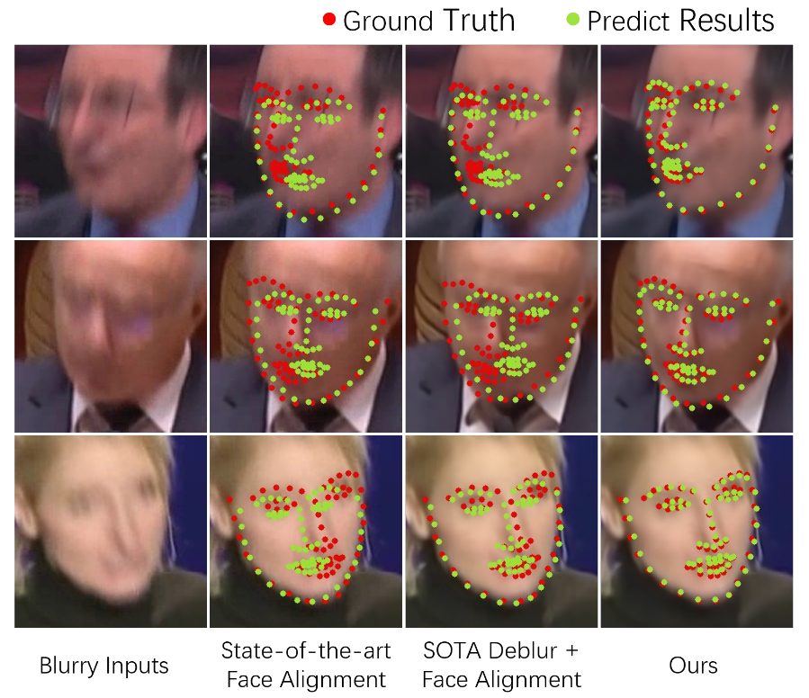

# FAB: A Robust Facial Landmark Detection Framework for Motion-Blurred Videos

[Keqiang Sun](https://keqiangsun.github.io/),
[Wayne Wu](https://wywu.github.io),
[Tinghao Liu](https://github.com/KeqiangSun/FAB),
[Shuo Yang](http://shuoyang1213.me/),
[Quan Wang](https://github.com/KeqiangSun/FAB),
[Qiang Zhou](https://github.com/KeqiangSun/FAB),
[Chen Qian](https://scholar.google.com/citations?user=AerkT0YAAAAJ&hl=en),
and [Zuochang Ye](https://github.com/KeqiangSun/FAB)

[International Conference on Computer Vision (ICCV), 2019](http://iccv2019.thecvf.com/)


<div align=center>
  
</div>

We present a framework named FAB that takes advantage of structure consistency in the temporal dimension for facial landmark detection in motion-blurred videos. A structure predictor is proposed to predict the missing face structural information temporally, which serves as a geometry prior. This allows our framework to work as a virtuous circle. It is also a flexible video-based framework that can incorporate any static image-based methods to provide a performance boost on video datasets. Extensive experiments on Blurred-300VW, the proposed Real-world Motion Blur (RWMB) datasets and 300VW demonstrate the superior performance to the state-of-the-art methods.

Moreover, we proposed a new benchmark named Real-World Motion Blur (RWMB). It contains videos with obvious motion blur picked from YouTube, which include dancing, boxing, jumping, etc. A detailed description of the system can be found in our [paper](https://keqiangsun.github.io/projects/FAB/FAB.html).

## Citation
If you use this code or RWMB dataset for your research, please cite our paper.
```
@inproceedings{keqiang2019fab,
 author = {Sun, Keqiang and Wu, Wayne and Liu, Tinghao and Yang, Shuo and Wang, Quan and Zhou, Qiang and and Ye, Zuochang and Qian, Chen},
 title = {FAB: A Robust Facial Landmark Detection Framework for Motion-Blurred Videos},
 booktitle = {ICCV},
 month = October,
 year = {2019}
}
```

## Prerequisites
- Linux
- Python 2
- [TensorFlow](https://www.tensorflow.org/)

## Getting Started

### Blurred-300VW Dataset Download
[Blurred-300VW](https://keqiangsun.github.io/projects/FAB/Blurred-300VW.html) is a video facial landmark dataset with artifical motion blur, based on [Original 300VW](https://ibug.doc.ic.ac.uk/resources/300-VW/).

0. Blurred-300VW [[Google Drive](https://drive.google.com/drive/folders/1aAe1vBoHZ78QlGjBEOup416tHNp4Ztcp?usp=sharing)] [[Baidu Drive]()]
1. Unzip the package and put them on './data/Blurred-300VW'

### Wider Facial Landmark in the Wild (WFLW) Dataset Download
[Real-World Motion Blur(RWMB)](https://keqiangsun.github.io/projects/FAB/RWMB.html) is a newly proposed facial landmark benchmark with read-world motion blur.

0. RWMB Testing images [[Google Drive](https://drive.google.com/file/d/1vv7Qppg9R3xlj_O2dmtXZHzEnObOwoDh/view?usp=sharing)] [[Baidu Drive]()]
1. Unzip the package and put them on './data/RWMB'


### Training FAB on Blurred-300VW

```bash
bash ./scripts/train.sh
```

### Testing FAB on Blurred-300VW

```bash
bash ./scripts/test.sh
```


## To Do List
Supported dataset
- [x] [300 Faces In-the-Wild (300W)](https://ibug.doc.ic.ac.uk/resources/300-W/)
- [x] [300 Videos in the Wild(300W)](https://ibug.doc.ic.ac.uk/resources/300-VW/)
- [x] [Blurred 300VW](https://keqiangsun.github.io/projects/FAB/RWMB.html)
- [ ] [Real-World Motion Blur(RWMB)](https://keqiangsun.github.io/projects/FAB/RWMB.html)


Supported models
- [ ] [Pretrained Model of Structure Predictor Block]
- [ ] [Pretrained Model of Video Deblur Block]
- [ ] [Pretrained Model of Resnet Block]
- [ ] [Pretrained Model of Final model]


## Questions
Please contact skq719@gmail.com
